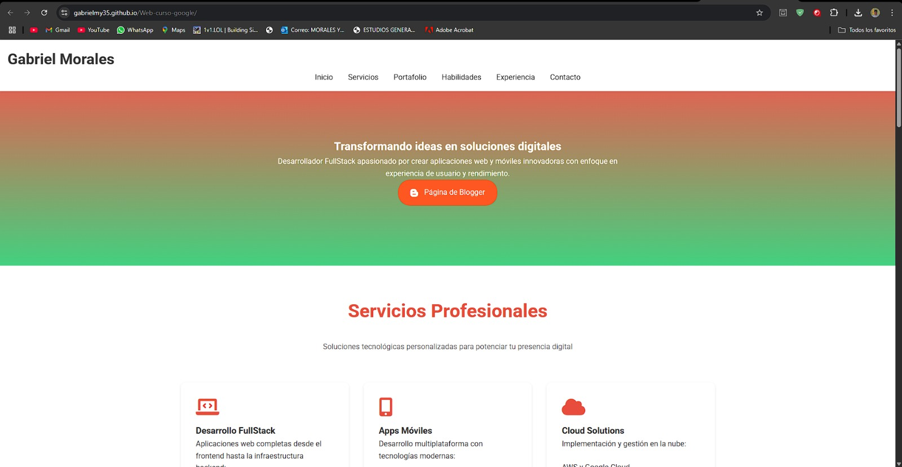

# 💼 Portafolio Profesional - Gabriel Morales

[](https://opensource.org/licenses/MIT)
[](https://gabrielmy35.github.io/Portafolio/)
[](https://gablogmy35.blogspot.com/)

🔗 **URL Oficial:** [gabrielmy35.github.io/Web-curso-google](https://gabrielmy35.github.io/Web-curso-google/)

> Portafolio profesional moderno que muestra habilidades, proyectos y experiencia en desarrollo web y móvil.

---



---

## 🌐 Acceso Directo

- 🔹 **Versión en producción:** [Visitar Sitio Web](https://gabrielmy35.github.io/Web-curso-google/)
- 🔹 **Repositorio GitHub:** [Ver Código Fuente](https://github.com/Gabrielmy35/Web-curso-google)

---

## 🚀 Características Principales

- ✅ Diseño **responsive** y minimalista
- ✅ Sección de **proyectos** con detalles técnicos
- ✅ Stack tecnológico visual con **barras de progreso**
- ✅ Experiencia profesional en **línea de tiempo**
- ✅ **Formulario de contacto** funcional
- ✅ Integración con **redes profesionales**
- ✅ **Blog técnico** personalizado
- ✅ Paleta de colores **personalizable**
- ✅ Optimizado para **SEO básico**

---

## 🛠 Tecnologías Utilizadas

### Frontend

- 🔧 **HTML5** Semántico
- 🎨 **CSS3** Moderno (Grid, Flexbox)
- ⚙️ **JavaScript Vanilla**
- ⭐ **Font Awesome** (Iconos)
- 🔤 **Google Fonts** (Tipografía)

---

## 🗂 Estructura del Proyecto

```
📦 Web-curso-google
├── 📄 index.html
├── 📄 estilo.css
├── 📄 animaciones.js
├── 📷 read.jpeg
├── 📷 ReGreen.png
├── 📷 imagen1.jpeg
└── 📄 README.md
```

---

¡Gracias por visitar mi portafolio! Si deseas colaborar o tienes alguna propuesta, no dudes en contactarme. 🚀
